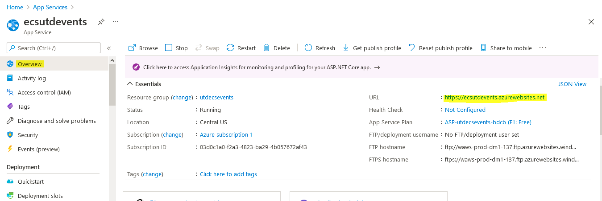
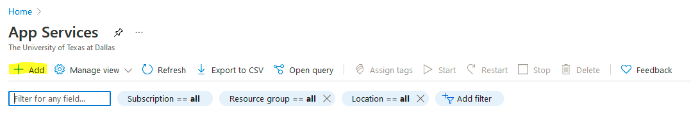
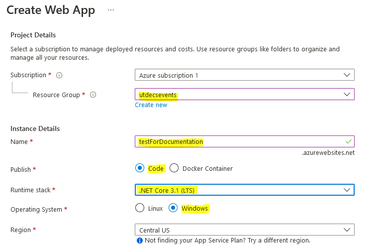
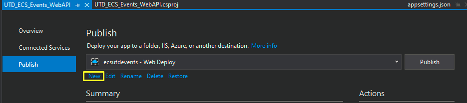
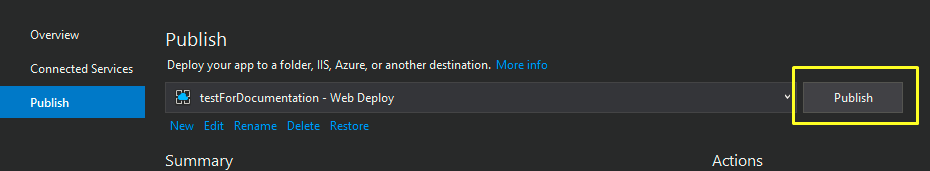

# Back-End

## Deploying the Backend
We use [Azure](Hosting site: https://azure.microsoft.com/en-us/services/app-service/) for hosting the backend. The API calls from the front-end route through the base URL `https://ecsutdevents.azurewebsites.net`. If this URL changes, it will be updated in the *overview* tab in the following image.

### New Deployment from Visual Studio
Here are instructions for creating a new backend deployment in Azure. First, select *App Services* from the Azure [website](https://portal.azure.com/#home).

Next, click *Add* to create a new app service.

Fill out the details.

!!! note
    The *Name* parameter will change the URL of the API.

!!! note
    For the *Runtime Stack*, we are currently using *.Net Core 3.1*, but you can check in the `.csproj` file within visual studio:

    

Click *Review and Create*.

Click *Create*.

Go to *Build* -> *Publish UTD_ECS_Events_WebAPI* on Visual Studio.

Click *New*.

Select *Azure* and click *Next*

Select *Azure App Service (Windows)* and click *Next*.

Select the App Service name that you created from step 3 and click *Finish*.

Click *Publish*.

You can check that it’s successfully deployed by going to the url and using any api calls.
i.e. `https://testfordocumentation.azurewebsites.net/api/events/all` should display the list of events.

!!! note 
    When deploying newly, to reduce the initial load time, see [Keeping the App Server Awake](#keeping-the-app-server-awake).

### Publishing to the Existing App form Visual Studio
Go to *Build* -> *Publish UTD_ECS_Events_WebAPI* on Visual Studio.

Select the destination using the drop down.

!!! note
    If you do not see the destination you want to publish to (if you haven’t created it yet), follow the steps 7-10 of the section [New Deployment from Visual Studio](#new-deployment-from-visual-studio) to add a new destination.

Click *Publish*.

You can check that it’s successfully deployed by going to the url and using any api calls.
i.e. `https://testfordocumentation.azurewebsites.net/api/events/all` should display the list of events.

### Notes on Azure App Services
Limitations of using free service: Always on is set to False. See [Keeping the App Server Awake](#keeping-the-app-server-awake).
We can’t use a custom domain name. This is why we’re using Firebase hosting for front-end hosting.
We don’t have remote access to the machine. CPU is shared.

## Running backend locally and without Visual Studio
If you just want to run the backend build (not front end) on your local computer, here are some instructions.

### Prerequisites
First you'll want to ensure you have .NET Core downloaded. You will need at least version 3.1 or above.
You can check your version by running: `dotnet --version`.
Download **.NET Core** from [here](https://dotnet.microsoft.com/download).

### Find the file to run
Whenever the back-end team makes changes and runs their code in Visual Studio they are actually creating build files which we will use to run the code directly rather than recompiling it.

You'll find the file we want to run in [this repo](https://github.com/ecs-utd-events/ecs-utd-events) at the following location: `ecs-utd-events/backend_build/bin/Debug/netcoreapp3.1/UTD_ECS_Events_WebAPI.dll`.
Once you find this file you'll want to copy either a relative path or full path and simply run: `dotnet <insert_filepath>` to begin running the program.

### Check with Postman
The application will be running at the following URL: `http:localhost:80/`, and you can now send requests using [Postman](https://www.postman.com/downloads/).
You can currently (as of 02/18/21 @ 11:27:59 PM) send a GET, POST, or DELETE request to `http:localhost:80/api/events`.
If you simply want to check the GET request you can also use any internet browser.

### Keeping the App Server Awake
Website: `https://uptimerobot.com/`. Uptime robot pings the server every 5 minutes to keep it awake. Login with `utdecsevents@gmail.com` google account.

## Backend Code
### Software Design

The backend consists of three primary layers:
- **Repository**: This layer is responsible for sorting, searching, and executing queries against the Cloud Firestore database. 
- **Service**: This layer is the middleware between the user-facing API and the database. It could be used to alter the type or model of data received from the database before it is sent to the user. For example, if the user wanted all events without their id, the service would ask the repository for all events, then modify them to remove all their ids, and then return it to the user.
- **Controller**: This is where the API endpoints of the server are defined. It will parse and authenticate the API request sent to it, and on success, call the appropriate service method to retrieve the data required. 

### Adding a GET API call
- Navigate to the appropriate repository file in `Repositories`. Create an `async` method that does the following:
  - Executes a query against the database with the appropriate filters as required by the GET API call.
  - Returns all the documents returned by the query.
- Navigate to the appropriate service file in `Services`. Create a method that calls the method you defined in the repository and makes it execute the task. Return the result of that task.
- Navigate to the appropriate controller file in `Controllers`. Create a new method in that file with the following:
  - Appropriate parameters (for example, if the user wants to get all events by tag, then the tag should be a parameter)
  - Specify the URL users will use to access this API endpoint above the method: `[HttpGet("<URL_here>")]`
  - Return type should be the appropriate type enclosed within `ActionResult<my_type>`
  - The method should call the service method you defined and return the result.

### Authentication

